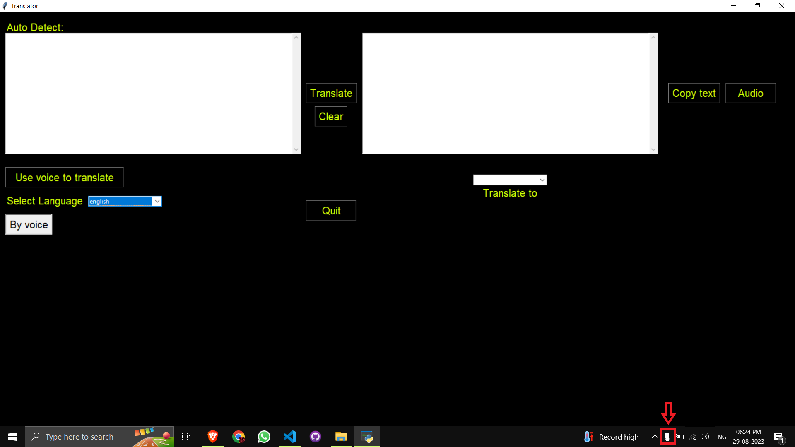
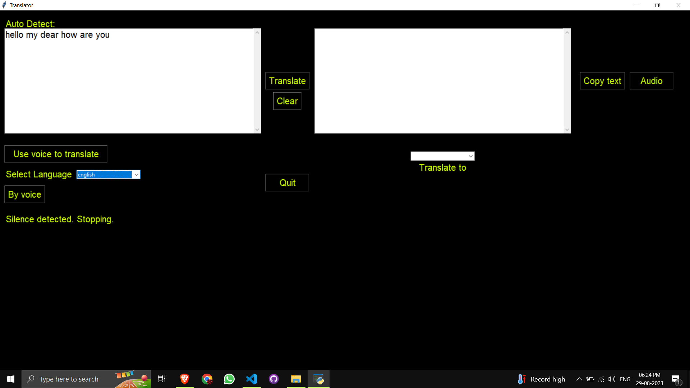

# Translator-GUI
- A GUI Python program for translating text or speech.
- It uses the follwing libraries:  

1. `Googletrans` to translate from one language to another  
2. `Gtts`to convert text to speech  
3. `Speech_Recognition` to record sound from the user  
4. `Playsound` to play the output file of the gtts

# Installation
-To run this application, you need to have Python 3.x installed on your system. You can download Python from the official website: https://www.python.org/downloads/.

-Once you have Python installed, you need to install the required modules using pip. Open a command prompt or terminal window and run the following command:

pip install `-r requirements.txt`

-This will install the packages.

# Using the Program/Working
-To run the application, open a command prompt or terminal window and navigate to the directory where the Translator.py file is located. Then run the following command:

python Translator.py

-After running the program, enter your text that has to be translated on the left hand side textbox and select the language you want to translate to from the combobox that is above "Translate to" and press "Translate" to translate your input text.

-If you want to give the input by voice press the "Use voice to translate button" and after that select the language that you will speak in, then press the "By voice" button and wait for the microphone to appear on taskbar after which the recording will start and it will automatically stop after silence has been detcted.

-In addition the "Clear" button clears all the previous data, the "Copy text" copies the translated text into the clipboard, the "Audio" button plays the translated text in the form of audio and the "Quit" button to exit the window.

# Screenshots

# Follow me and Star ⭐ my Repository

# Thank You!
